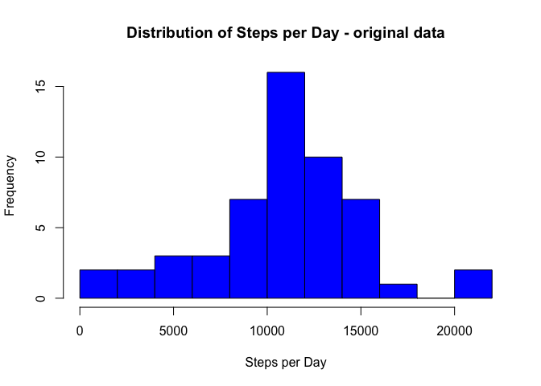

# Reproducible Research: Peer Assessment 1


## Loading and preprocessing the data
The following code downloads, extracts (unzips), and loads the data.  The "date" field is converted to POSIXct.

```r
download.file("https://d396qusza40orc.cloudfront.net/repdata%2Fdata%2Factivity.zip", 
              "activity.zip", method = "curl")
unzip("activity.zip") 
actdata <- read.csv("activity.csv", header = TRUE,  na.strings = "NA")
actdata$date <- as.POSIXct(actdata$date)
```
The resulting data frame contains 17568 records of **steps** taken in each time **interval** for each **date** (names of columns in bold). 


```r
head(actdata)
```

```
##   steps       date interval
## 1    NA 2012-10-01        0
## 2    NA 2012-10-01        5
## 3    NA 2012-10-01       10
## 4    NA 2012-10-01       15
## 5    NA 2012-10-01       20
## 6    NA 2012-10-01       25
```

## What is mean total number of steps taken per day?

In this section, the steps are summed for each date and plot a histogram of the number of steps per day, ignoring the missing values in the original data.

 


The mean number of steps per day is 1.0766 &times; 10<sup>4</sup> while the median is 10765.


## What is the average daily activity pattern?

To determine the average number of steps for each time interval, averaged over all days, the records with NA values are removed before calculating the mean for each time interval:


```r
NAremoved <- actdata[!is.na(actdata$steps),]
avgsteps1 <- aggregate(NAremoved$steps, by = list(NAremoved$interval), mean)
plot(avgsteps1$Group.1, avgsteps1$x, type = "l", main = "Average Daily Activity 
     Pattern", xlab="Time Interval", ylab="Number of Steps")
```

 

The time interval with the highest average number of steps across all the days in the dataset is interval number 835.


## Imputing missing values

The total number of missing values for number of steps in the original data set is 2304.  The average steps for each time interval was substituted where values were missing in the original data set using the code below. First, a new data frame was created by merging activity data with average steps by time interval.  Then a new field was added to hold the filled-in steps data:  the original value was used where present and the time interval averaged was used where data were missing.  A new summary data frame was created from the filled in data.


```r
filled <- merge(actdata, avgsteps1, by.x = "interval", by.y="Group.1")
filled$modsteps <- ifelse(is.na(filled$steps), filled$x, filled$steps)
sumsteps2 <- aggregate(filled$modsteps, by=list(filled$date), sum)
```
The figure below shows a histogram of the average number of steps per day with the modified data.

 

The mean number of steps per day 1.0766 &times; 10<sup>4</sup> and median 1.0766 &times; 10<sup>4</sup> now turn out to be the same.


## Are there differences in activity patterns between weekdays and weekends?

To look at differences in activity patterns on weekdays compared to weekends, the weekdays function was used to extract the name of the day of the week for each record (i.e. “Sunday”, “Monday”,…”Saturday”).  A new factor variable then identified each record as “Weekday”(Monday through Friday) or “Weekend” (Saturday or Sunday).  Separate averages for each time interval were calculated for weekdays and weekend days.


```r
filled$day <- weekdays(filled$date)
filled$daytype <- ifelse(filled$day =="Saturday" | filled$day == "Sunday", 
                         "Weekend", "Weekday")
wkdayavg <- aggregate(filled$modsteps[filled$daytype=="Weekday"], 
                      by = list(filled$interval[filled$daytype=="Weekday"]), mean)
wkendavg <- aggregate(filled$modsteps[filled$daytype=="Weekend"], 
                      by = list(filled$interval[filled$daytype=="Weekend"]), mean)
```


The plots below show distinct differences between the weekday and weekend activity patterns.  The weekday pattern has one peak early in the day and then falls off to lower levels.  The weekend activity pattern does not have as high a peak as the weekday but remains more constant through the middle of the day.


 
